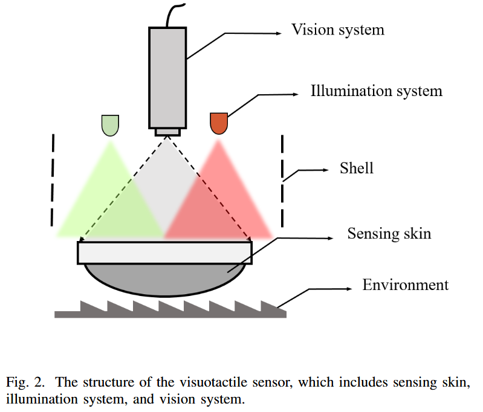

# When Vision Meets Touch: A Contemporary  Review for Visuotactile Sensors from the Signal  Processing Perspective

视触觉传感器结合了光学成像与触觉感知，通过摄像头捕捉传感器表面变形 。

## I. 引言 (Introduction)

- 不仅获取执行器与环境之间的接触力，还需要终端工具在手中的位置。

传感器：压电，摩擦电，压阻。面临**制造工艺复杂**、**数据采集电路昂贵**以及**难以低成本实现高分辨率和大面积感知**等挑战。

视觉感知范围大，但在操作过程中很难获得**被遮挡物体的姿态**以及**接触信息**。

- 将视觉感知与触觉感知相结合，利用摄像头来检测传感器表面的变形。视觉触觉传感器最重要的功能是 3 维重建。
- 设计视觉-触觉传感器

## II 传感器的设计

硬件结构（如标记点的有无、照明方式）直接决定了后续信号处理算法的选择.

- 通过光度立体和双目成像，可以实现接触表面3D形状的实时重建

- 还可以实现接触区域分割、高分辨率力感知、滑动检测以及映射和定位，显着提高了物体抓取和操纵的稳定性

传感皮肤是视觉触觉传感器的核心部件，能够通过与物体接触时的变形或颜色变化来检测和表示诸如力、温度和纹理等信息

### **感测皮肤 (Sensing Skin)**

**1. 形状**：分为2D（如**GelSight**，**Digit**，适合平坦表面）和3D（如**GelTip**，适合**多角度**抓取） 

GelTip, TouchRoller, Soft-bubble, Insight, TaTa

3D

- 在不同接触点引起变形的力的大小和方向可能差异很大，使得**重建**和感知变得复杂。

- 确保结构从各个方向获得均匀的**照明**。

**2. 标记** (Marker)：讨论了无标记、单色点阵、双层彩色标记、致密随机纹理等设计，标记用于追踪变形以计算力和滑动。

- 根据标记的尺寸变化和位移，传感器可以获得法向力、切向力和滑移信号。 
- 无法提供高分辨率的力分布：增加密度，但是对纹理检测有影响。

**3. 材料**：主要是硅胶（易成型、兼容性好）、乳胶（弹性、韧性好但难定制，抓取物体时需要注入气体以增加刚度）和PDMS（高透明度）

**4. 功能材料和结构**：引入功能材料和结构，丰富了机械手的感官功能并提高了机械手的性能。

- 结合**纹理和温度**检测

### **照明系统 (Illumination System)** 

安装位置和颜色：位于感应皮肤的侧面和下方

下方：难以保证光强度一致性；侧面：光线会在感应皮肤内部传播；接触位置不同方向**显示不同颜色**。

包括白光（提升亮度）、RGB光（用于光度立体法重建3D形状）和UV光（荧光标记，分离纹理与标记）  

### **视觉系统 (Vision System)** 

视觉系统作为信号采集单元，通过光学成像捕捉传感皮肤产生的形变和颜色信息。

视觉系统可分为单目相机、双目相机、深度相机和基于事件的动态视觉传感器（DVS）。

- 单目RGB相机：GelSight, Digit, 尺寸、视场 (FOV)、焦距和分辨率

- 双目RGB相机：通过双目匹配计算深度信息，不受光照条件影响，只需要校准内参和外参。选择单目相机时，尺寸、视场 (FOV)、焦距和分辨率是需要考虑的关键因素。相机的尺寸通常决定传感器的尺寸，而视场和焦距则决定传感器的厚度。

- 深度相机：尺寸较大
- 事件相机：价格昂贵，分辨率低，信噪比差

- 对于深度重建，单目相机通常与光度立体方法相结合，并且在使用双目相机时通常使用双目成像。

## III 视触觉传感器的信号处理 (Signal Processing for Visuotactile Sensor)

**1. 接触区域分割 (Contact Area Segmentation)**

感应皮肤的颜色和纹理会发生变化。**提取接触位置和面积信息**可以进一步提高机器人抓取物体的稳定性和成功率。

利用传统图像处理（如背景差分法，提取最大连通域）或深度学习（如FCN网络）提取接触区域 。

**2. 3D重建 (3D Reconstruction)**

该任务的目标是在传感器表面生成密集的**深度信息点云**，这对于提高发生视觉遮挡时**物体姿态估计**的准确性特别有用。

基于光度立体、亮度重建、双目成像、结构光和飞行时间（ToF）、密集光流和深度学习的视觉触觉传感器的主流形状重建技术。

1. 光度立体法 (Photometric Stereo)：利用光照梯度计算法向量重建表面，是主流方法 。需要传感器内部**高亮度**，优化照明系统。假设传感器形状和亮度仅取决于法线。通过计算**每个像素点的法向力**来完成传感器的表面重建。

   > **输入：**
   >
   > **原始触觉图像 (Raw Tactile Image):** 传感器相机捕捉到的RGB图像。
   >
   > **已知条件:** 光源的方向向量（Light Vectors, $\vec{l}_1, \vec{l}_2, ...$）和光源的强度/颜色。
   >
   > **输出：**
   >
   > **表面法线图 (Surface Normal Map):** 图像中每个像素点的法向量 $\vec{n}(x,y)$，表示该点表面的朝向。
   >
   > **梯度图 (Gradient Map):** 表面的斜率 $(p, q) = (\frac{\partial z}{\partial x}, \frac{\partial z}{\partial y})$。
   >
   > **深度图/高度图 (Depth/Height Map):** 最终通过对梯度图进行积分得到的3D形貌 $z(x,y)$。

2. 
   亮度重建法：基于光线穿过半透膜的衰减原理 。根据亮度信息计算深度。

3. 双目/多目成像：计算视差，但受基线长度限制 。

4. 飞行时间和结构光方法：

5. 密集光流法：

6. 深度学习法：用于无标记或复杂场景的重建 。

**3. 力感知 (Force Perception)**

1. 标记检测法：通过**追踪标记点的位移**来解耦**法向力和切向力** 。

2. 
   有限元分析 (FEM)：结合材料特性模拟形变与力的关系 。

3. 深度学习：直接从图像预测力分布热图 。**在没有marker的情况下提取传感器的力。**

4. 校准是视觉触觉传感器实现力传感的重要组成部分。

**4. 滑动检测 (Slip Detection)**

通过监测标记点的位移场熵值、Stick ratio（粘滞比率）或光流场变化来判断物体是否发生滑动 。

需要根据滑动信号及时调整抓取力和抓取策略。

- 当接触力存在水平分力，且水平力大于摩擦力时，就会发生滑动。 
- 根据**位移场偏移分布熵**判断是否发生滑移的方法。位移场分布越不均匀，熵就越高，滑移的可能性就越高，但这种方法只有在接触物体表面平坦且接触面纹理较小时才有效。
- 传感器检测**纹理和距离**，无法检测与光滑或透明物体的滑动

输入输出

- 检测的物理量：振动、温度、切向力

- 滑动检测网络：以10组传感器的序列作为输入，每个序列包含一个变形场及其在x轴和y轴上的投影。
- 视觉、触觉图像作为输入

实验设计

- 通过滑动检测来测试抓取物体所需的最小力
- 使用滑动传感算法检测滑动的发生并及时调整抓取力

**5. 映射与定位 (Mapping and Localization)**

确定物体在坐标系中的位置和方向

1. Edge contour exploration 边缘轮廓

   - **边缘**跟随；感知物体轮廓实现物体抓取

   - 利用神经网络提取TacTip传感器与物体接触的轮廓/表面

   - Lepora等人进一步优化了模型，提出了名为PoseNet的触觉伺服控制模型 。该模型能够检测物体表面的轮廓和边缘，并在Digit、DigiTac和TacTip三种不同的传感器上测试了其通用性 。

2. In-hand object pose estimation 手中物体姿态

   - 机器人的手指在抓手抓取物体时会阻挡物体，因此很难通过视觉准确估计物体的位姿。
   - 建立**触觉和局部形状**的映射
   - **分步估计法**：Kuppuswamy等人基于Soft-bubble传感器提出了一种分步估计方法：先用正向模型预测接触变形，再用逆向模型提取接触区域，最后利用ICP实现姿态估计 。

3. object pose estimation in the scene 场景中的物体姿态估计

   - **触觉辅助的单目深度重建**：Wang等人提出了一种方法，首先通过单目视觉粗略重建物体轮廓，然后利用触觉反馈更新和优化物体的轮廓信息 。
   - **蒙特卡洛全局定位**：Suresh等人提出了一种基于蒙特卡洛的方法，根据传感器与物体接触的位置以及传感器的移动路径，获取传感器相对于物体的位置信息 。
   - **多传感器协同校准**：Chaudhury等人构建了一个包含深度相机、彩色相机和触觉传感器的感知平台 。该方法首先由视觉引导发现目标，然后利用深度图像估计物体姿态，最后使用触觉传感器对姿态进行校准 。

**6. 仿真到现实 (Sim-to-Real)**

利用物理仿真引擎（如Gazebo, PyBullet）和渲染技术（如Phong模型、CycleGAN）生成合成触觉数据，解决深度学习数据不足的问题 

## IV 视触觉传感器的应用 (Application of Visuotactile Sensors)

**分类 (Classification)**：识别织物纹理、化石、物体硬度、形状及液体属性 

**抓取 (Grasping)**：在低能见度环境、透明物体抓取以及基于触觉反馈的稳定抓取策略 

**操作 (Manipulation)**：高精度的装配任务（如插孔、USB插入）、线缆操作、精细物体（如食物）处理 

**其他应用**：机器人足部感知（地形识别）、机械臂全身皮肤感知

## V 讨论与展望 (Discussion and Perspectives)

**硬件设计方面**：多模态（融合热、痛觉等）、便携性（减小体积）、柔性化（全身覆盖）和高灵敏度 

**信号处理方面**：

光场控制（提高重建精度） 

多传感器融合（视觉、听觉、触觉） 

闭环控制框架（实时反馈） 

触觉重建和定位

逼真的模拟引擎

面向任务的优化

大触觉-语言模型：结合LLM提升机器人的认知与操作能力 

参考文献

[1] W. Yuan, S. Dong, and E. H. Adelson, “**GelSight**: High-resolution robot tactile sensors for estimating geometry and force,” Sensors, vol. 17, no. 12, p. 2762, 2017.

[2] S. Wang, Y. She, B. Romero, and E. Adelson, “**GelSight** wedge: Measuring high-resolution 3D contact geometry with a compact robot finger,” in IEEE International Conference on Robotics and Automation (ICRA), 2021, pp. 6468–6475.

