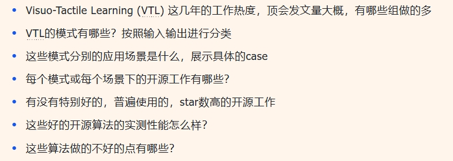

# Visuo-Tactile Learning

## 论文

1. LightTact: A Visual–Tactile Fingertip Sensor for Deformation-Independent Contact Sensing https://arxiv.org/pdf/2512.20591 

2. UniTacHand: Unified Spatio-Tactile Representation for Human to Robotic Hand Skill Transfer

3. Flexible Robotic Hand Harnesses Large Deformations for Full-Coverage Human-like Multimodal Haptic Perception https://doi.org/10.1038/s41467-025-67148-y 

4. ManiSkill-ViTac 2025: Challenge on Manipulation Skill Learning With Vision and Tactile Sensing (https://ai-workshops.github.io/maniskill-vitac-challenge-2025/) 

5. ForceVLA: Enhancing VLA Models with a Force-aware MoE for Contact-rich Manipulation 借助力反馈
6.  VT-Refine: Learning Bimanual Assembly with Visuo-Tactile Feedback via Simulation Fine-Tuning https://binghao-huang.github.io/vt_refine/

## Sensors

视觉 GelSight

视觉-触觉 

非视觉

## Robotics Applications

### ⭐Manipulation/Grasping

机器人操作和抓取任务：触觉表征

### Classification/Recognition

利用视觉数据增强触觉理解？ 借助视觉触觉进行物体表面/纹理分类和识别

### Mapping/Localization

借助视觉-触觉传感器进行物体**姿态追踪**，物体**表面重建**（例如透明物体）

### Extrinsic Contact Sensing

视觉触觉同步接触和物体姿态估计，将外在触觉反馈映射到**3D几何场**上

### Image Generation

触觉生成视觉

### ⭐Representation Learning

多模态触觉表征 

### Force Estimation

接触力反馈估计

### ⭐LLM/VLM/VLA

触觉数据用于大模型预训练

### ⭐Dexterous Manipulation

触觉反馈在机器人操作任务（如抓取、材质识别、灵巧操作）中被用于**修正动作预测**或**作为强化学习的奖励信号**

### Data Collection 

数据采集（传感器设计）

Reactive Diffusion Policy: Slow-Fast Visual-Tactile Policy Learning for Contact-Rich Manipulation, Xue et al., RSS 2025

### Tactile Policies for legged robots

LocoTouch: Learning Dynamic Quadrupedal Transport with Tactile Sensing, Lin et al., CoRL 2025

## II. 数据集

> 名称，采集设备，采集流程，规模与类型，数据组织结构，适用任务

GelSight 是一种基于光学的触觉传感器。它使用一块涂有金属涂层的弹性体（Elastomer），当弹性体被按压在物体表面时，其形状会发生形变。传感器内部的摄像头通过拍摄弹性体表面的形变图案（结合内部照明系统），能够以极高的分辨率捕捉物体表面的微观几何结构和纹理细节。

1. **Touch100k**: A Large-Scale Touch-Language-Vision Dataset for Touch-Centric Multimodal Representation, Cheng et al., arxiv 2024

| 名称          | 采集设备                   | 采集流程                         | 规模与类型                                      | 数据组织结构 | 适用任务                         |
| ------------- | -------------------------- | -------------------------------- | ----------------------------------------------- | ------------ | -------------------------------- |
| **Touch100k** | **GelSight Mobile** 传感器 | 手持 GelSight 传感器按压物体表面 | **样本总量**：**102,000** (102k) 组配对数据。   |              | 给定触觉图像，生成描述它的文本。 |
|               |                            |                                  | **物体覆盖**：涉及 **5,385** 个独特的物体实例。 |              | 根据文本描述检索对应的触觉纹理。 |
|               |                            |                                  | **类别覆盖**：涵盖了 **133** 个物体类别。       |              | 对齐触觉、视觉和语言的特征空间   |

2. **Vint-6d**: A large-scale object-in-hand dataset from vision, touch and proprioception, 2025

| 名称        | 采集设备                   | 采集流程                         | 规模与类型                                    | 数据组织结构 | 适用任务                         |
| ----------- | -------------------------- | -------------------------------- | --------------------------------------------- | ------------ | -------------------------------- |
| **Vint-6d** | **GelSight Mobile** 传感器 | 手持 GelSight 传感器按压物体表面 | **样本总量**：**102,000** (102k) 组配对数据。 |              | 给定触觉图像，生成描述它的文本。 |

3.  **TacBench**：Touch-Slide和YCB-Slide

| 名称                   | 采集设备                                                     | 采集流程 | 规模与类型                             | 数据组织结构 | 适用任务                                                     |
| ---------------------- | ------------------------------------------------------------ | -------- | -------------------------------------- | ------------ | ------------------------------------------------------------ |
| Touch-Slide和YCB-Slide | 视触觉传感器（Vision-based Tactile Sensors） **GelSight Mini**：用于获取高分辨率的表面纹理和形变图像。**DIGIT**：Meta开源的紧凑型视触觉传感器，常用于指尖。 |          | 传感器在物体表面滑动时的高帧率触觉视频 |              | **力估计 (Force Estimation) [T1]**：预测法向力和剪切力。     |
|                        |                                                              |          |                                        |              | **力场可视化 (Force Field Visualization) [T1A]**：生成接触面上的力分布场。 |
|                        |                                                              |          |                                        |              | **滑移检测 (Slip Detection) [T2]**：判断传感器与物体之间是否发生相对滑动。 |
|                        |                                                              |          |                                        |              | **位姿估计 (Pose Estimation) [T3]**：估计物体相对于传感器的SE(2)平面位姿变化。 |
|                        |                                                              |          |                                        |              | **抓取稳定性预测 (Grasp Stability Prediction) [T4]**：判断当前抓取是否稳固。 |
|                        |                                                              |          |                                        |              | **操作规划 (Manipulation Planning) [T6] & 纹理识别 [T5]**：如“算盘珠迷宫（Bead Maze）”任务，要求机器人根据触觉反馈移动珠子，以及纺织品纹理分类。 |

4. **TVL Dataset**

| 名称    | 采集设备 | 采集流程                                                     | 规模与类型 | 数据组织结构 | 适用任务 |
| ------- | -------- | ------------------------------------------------------------ | ---------- | ------------ | -------- |
| **TVL** |          | 手持装有DIGIT传感器和摄像头的采集设备，触摸数百种日常物品。  |            |              |          |
|         |          | 利用GPT-4V强大的视觉理解能力，自动生成关于物体触觉属性的详细文本描述（如“带有凸起纹理的坚硬塑料表面”）。 |            |              |          |

5. **ManiWAV (Audio-Tactile)** 

除了传统的触觉，**ManiWAV** 引入了音频作为触觉的代理模态。接触产生的声音（高频振动）携带了关于材质硬度、粗糙度和接触事件（Impact Events）的丰富信息。ManiWAV数据集展示了如何利用音频辅助机器人感知接触状态，这在某些触觉传感器难以安装或带宽受限的场景下具有重要意义。

6. **STAG Dataset**

7. **Open X-Embodiment: Robotic Learning Datasets and RT-X Models**

## III. 触觉基础模型——架构、预训练与表征学习

通过自监督学习和跨模态对齐，从异构、稀缺的触觉数据中提取通用的物理表征

> 架构，输入，输出，预训练目标，下游微调，适用场景

**✔️方案对比**

| **模型名称**  | **核心架构**                   | **输入**                         | 输出 | **预训练目标**               | **关键特性**                | **适用场景**                     |
| ------------- | ------------------------------ | -------------------------------- | ---- | ---------------------------- | --------------------------- | -------------------------------- |
| **UniTouch🔺** | Transformer + ImageBind Anchor | 异构（GelSight, ReSkin等）+ 视觉 |      | 跨模态对比学习 (Contrastive) | 零样本迁移，传感器特定Token | 多模态交互，触觉问答，跨模态生成 |
| **Sparsh**    | ViT (I-JEPA / DINO / MAE)      | 视触觉图像 (GelSight/DIGIT)      |      | 自监督学习 (Masked Modeling) | 潜在空间预测，抗光照噪声    | 通用特征提取，滑移检测，材质分类 |
| **3D-ViTac**🔺 | PointNet++ / Transformer       | **触觉点云 + 视觉点云**          |      | 扩散策略行为克隆             | 显式3D几何融合，抗遮挡      | 灵巧手操作，精密装配，物体交接   |
| **TVL**       | CLIP-Aligned Encoder           | 触觉 + 视觉 + 语言               |      | 视觉-语言-触觉对比学习       | 语义对齐，GPT-4V辅助标注    | 开放词汇材质理解，属性推理       |
| **Octo**🔺     | Transformer (Tokenized)        | 视觉 + 语言 + 触觉Token          |      | 下一个Token预测 / 扩散解码   | 通用机器人策略微调          | 广泛的机械臂操作任务，多任务泛化 |

## IV. 触觉驱动的机器人动作训练策略

> 如何将这些触觉表征转化为机器人的精准动作?

### 4.1 隐式特征融合：Transformer Tokenization与注意力机制

> 以**Octo** 为代表的通用机器人策略（Generalist Robot Policies）

**触觉Token化流程**

为了进入Transformer的上下文窗口，连续的高维触觉数据必须被离散化或压缩为Token。

- **Patchify与编码**：对于视触觉图像，通常先将其分割为Patch（例如16x16），然后通过预训练的编码器（如Sparsh或ResNet）提取特征向量。
- **投影与注入**：特征向量经过线性投影层（Projection Layer）映射到与主模型相同的维度（例如768维），并附加上位置编码（Spatial/Temporal Embeddings）。

- **历史窗口（History Window）**：触觉的瞬时值往往不如变化趋势重要。因此，输入通常包含过去$k$帧（如16帧）的触觉Token序列，使模型能够感知接触力的导数（Derivative）和滑移趋势 。

 **跨模态注意力机制（Cross-Modal Attention）**

- **注意力重定向**：研究观察到，在机器人未接触物体时，模型的注意力权重主要集中在视觉Token上（用于定位）；一旦触觉Token显示接触发生，注意力权重会迅速转移到触觉Token和本体感觉Token上。这种动态的注意力分配机制（Attention Re-weighting）使得模型能够在不同阶段依赖最可靠的感官信息，模拟了生物神经系统的感知切换机制 。

### 4.2 显式几何融合：3D点云与扩散策略

> **3D-ViTac**: Learning Fine-Grained Manipulation with Visuo-Tactile Sensing 

对于需要极高精度的操作（如USB插拔、精密零件装配），隐式Token融合往往丢失了精确的空间信息。

**严重遮挡任务 (Heavy Occlusion)**：例如“手内操作”（In-hand manipulation）或“插孔”（Peg insertion）。当机械手抓住物体时，外部相机通常看不见物体与孔的接触点，此时 3D 触觉点云能像“透视眼”一样补全接触面的几何形状。

**易碎物体操作 (Fragile Interaction)**：例如“蒸蛋”任务（抓取生鸡蛋）或“处理葡萄”。需要通过触觉反馈精确控制力度，防止捏碎物体。

**精细装配 (Fine-Grained Assembly)**：例如收集六角扳手并插入孔中。这需要极高的毫米级精度。

#### **融合管线**

1. **反投影**：利用深度图（Depth Map）和触觉阵列的已知几何参数，将触觉读数转换为点云 $P_{tactile}$。
2. **坐标统一**：通过手眼标定矩阵 $T_{camera}^{hand}$，将视觉点云 $P_{visual}$ 和触觉点云 $P_{tactile}$ 变换到世界坐标系。

3. **体素化或采样**：为了处理点云密度的不一致，通常采用最远点采样（Farthest Point Sampling, FPS）或体素化网格（Voxel Grid）进行归一化。

#### **扩散策略（Diffusion Policy）的条件生成**

- 在动作生成阶段，扩散模型被广泛采用。扩散模型通过逐步去噪生成动作序列，不仅能建模多模态分布（例如，抓取同一个杯子可能有多种合法的姿态），还能很好地处理触觉带来的高频扰动。

- **触觉作为强约束**：在扩散模型的逆向生成过程中，触觉特征作为强条件（Conditioning）输入。实验表明，当触觉信号检测到意外碰撞时，扩散模型能够迅速生成“回撤”或“柔顺化”的动作轨迹，这种反应速度和合理性远超传统的行为克隆模型 。

### 4.3 强化学习（RL）：触觉奖励塑形与推理辅助

> 在强化学习领域，触觉数据主要用于解决稀疏奖励（Sparse Reward）难题，并提供安全约束。

#### 奖励塑形

传统的RL任务通常只有二元奖励（成功+1，失败0），导致探索效率极低。触觉可以提供密集的中间奖励。

- **接触奖励**：$R_{contact} = \mathbb{I}(Force > \epsilon)$，鼓励机器人尝试接触物体。
- **稳定性奖励**：$R_{stability} = - \alpha \times ||\text{Slip}||$，通过检测滑移信号惩罚不稳定的抓取。

- **力控奖励**：$R_{force} = - \beta \times |F_{current} - F_{target}|$，引导机器人施加恰当的力 。

#### 推理辅助

利用推理能力强的大模型（如**DeepSeek-R1**或**GPT-4**）来辅助设计复杂的触觉奖励函数。

**逻辑链条**：DeepSeek-R1等模型可以通过推理（Reasoning），将抽象的任务目标（如“温柔地擦拭桌子”）分解为具体的物理约束（如“法向力保持在2-5N之间”，“切向力覆盖污渍区域”）。

## V. 仿真技术与Sim-to-Real迁移

### 5.1 触觉仿真流水线：SimTacLS与Isaac Sim

Simulation, Learning, and Application of Vision-Based Tactile Sensing at Large Scale

Visuo-Tactile Sensor — Isaac Lab Documentation

### 5.2 生成式AI的数据增强

- **Diffusion Models的应用**：最新的研究利用文本条件扩散模型（Text-conditioned Diffusion Models）生成合成触觉数据。例如，通过输入“滑落的金属表面”，模型可以生成对应的触觉纹理图。这些合成数据被用于扩充训练集，特别是针对那些在真实世界中难以捕捉的边缘案例（Edge Cases，如极度危险的滑落瞬间）。

- **TactGen** ：该模型利用NeRF（神经辐射场）生成物体的视觉图像，再通过条件GAN（cGAN）将其转化为触觉图像，实现了跨模态的数据生成。

### 5.3 域随机化（Domain Randomization）

**参数扰动**：在训练过程中，随机扰动触觉传感器的关键参数（如光照强度、弹性体硬度、噪声水平、安装位置偏差）。这迫使模型学习鲁棒的特征，而非过拟合于仿真的特定参数。实验表明，经过充分域随机化训练的策略，可以直接部署到真实机器人上并保持较高的成功率。 

## VI. 未来工作

### 挑战

1. **硬件异构性与标准化缺失**：尽管UniTouch尝试在软件层面解决异构性，但硬件层面的碎片化依然严重。不同的GelSight变体在光照、分辨率、弹性体材质上差异巨大，阻碍了通用模型的推广。

2. **软件仿真瓶颈**：现有的物理引擎在模拟复杂的摩擦学现象（如粘滞滑移 Stick-Slip）、各向异性材质和微观纹理磨损方面仍显力不从心。这导致在涉及精细纹理感知的任务中，Sim-to-Real的鸿沟依然难以逾越。

### 方向

1. **触觉驱动的具身世界模型**：构建包含触觉的“世界模型”。这种模型不仅能预测视觉的未来，还能预测“触觉的未来”（Predictive Touch）——即在动作发生前，**预判手部将感受到的力和纹理**。
2. **传感器不可知（Sensor-Agnostic）学习**：随着UniTouch和Sparsh的进一步发展，未来的算法将更加解耦于硬件，允许机器人像更换鼠标一样更换触觉传感器，而无需重新训练整个大脑。

3. **推理与控制的深度融合**：DeepSeek-R1等推理模型的引入，将使得机器人能够处理更抽象的触觉任务（如“摸一下这个水果是否成熟”），将**高层语义推理与底层触觉反馈**紧密结合。

## 补充

#### Octo: An Open-Source Generalist Robot Policy

> 侧重于**高质量的特定任务模仿学习**
>
> ### 1. 配套数据集 (Datasets)
>
> Octo 的核心优势在于其使用的海量预训练数据：
>
> - **Open X-Embodiment 数据集**：Octo 主要在 **Open X-Embodiment** 数据集上进行训练。这是目前最大的机器人操作数据集，包含约 **80 万条** 真实的机器人轨迹（Trajectories）。
> - **多样性**：该数据集混合了来自 25 个不同数据集的数据，涵盖了多种机器人本体（如 Franka、Google Robot、WidowX 等）、不同的场景（实验室、家庭环境）以及各种操作任务。
> - **异构数据**：数据在传感器配置（有无腕部相机）、控制频率和标注类型（语言指令或目标图像）上具有高度异构性，这迫使模型学习处理不统一的输入格式。
>
> ### 2. 训练模型：输入与输出 (Model Architecture: I/O)
>
> Octo 采用 **Transformer-based Diffusion Policy**（基于 Transformer 的扩散策略）架构。其设计采用了类似于大语言模型（LLM）的 Token 机制，将所有模态的数据转化为 Token 进行处理。
>
> - **输入 (Inputs)**：模型支持灵活的观测和任务定义。
>   - **观测 (Observations)**：包含来自相机的图像序列（可以是第三人称视角、腕部相机视角或两者的组合）以及机器人的本体感知数据（Proprioception，如关节角度）。图像通过浅层卷积网络处理后被切分为 Patch Tokens。
>   - **任务 (Tasks)**：支持多模态任务指令。可以是 **自然语言指令**（通过预训练的语言模型如 T5 编码）或 **目标图像**（Goal Images）。
> - **输出 (Outputs)**：
>   - **动作块 (Action Chunks)**：模型不只是预测下一个时间步的动作，而是预测未来的一系列动作序列（Action Chunking）。
>   - **扩散解码 (Diffusion Decoding)**：Transformer 的输出 Token 会经过一个扩散模型（Diffusion Head）的“去噪”过程，解码为具体的连续动作值（如关节位置、速度或末端执行器位姿）。
>
> ### 3. 如何应用于机器人动作训练？ (Application to Robot Training)
>
> Octo 的主要应用范式是“预训练-微调”（Pre-train then Fine-tune），类似于 NLP 中的 GPT 或 BERT 模型。
>
> - **作为通用的策略初始化 (Policy Initialization)**：
>   - 用户无需从头开始训练。Octo 提供了一个已经学习了物理交互先验知识的强大“底座”模型。对于在预训练数据中见过的机器人（如 WidowX, RT-1），Octo 可以直接 **零样本（Zero-shot）** 部署并执行语言指令任务。
> - **高效微调 (Efficient Fine-tuning)**：
>   - **适应新形态**：如果你有一个新的机器人或新的传感器配置，只需收集少量的演示数据（例如 100 条轨迹），即可在 Octo 的基础上进行微调。
>   - **模块化适配器**：得益于 Transformer 的块状注意力结构（Block-wise Attention），用户可以添加或移除输入/输出适配器（Adapters）。例如，若要增加一个新的相机输入，只需为该相机添加对应的 Token 编码器并微调，而无需破坏预训练的主干权重。

#### RT-2: Vision-Language-Action Models Transfer Web Knowledge to Robotic Control

#### 3D-ViTac

#### VT-Refine: Learning Bimanual Assembly with Visuo-Tactile Feedback via Simulation Fine-Tuning

>**1. 统一 3D 空间表示 (Unified 3D Representation)**
>
>- **视觉流**：通过深度相机获取环境的 RGB-D 数据，并转换为**视觉点云 (Visual Point Cloud)**。
>- **触觉流**：使用高密度的压阻式触觉传感器（而非基于相机的GelSight）。通过机器人运动学（Kinematics）和传感器本身的几何模型，将触觉阵列上的压力读数直接投影到 3D 空间，生成**触觉点云 (Tactile Point Cloud)**。
>- **融合**：将视觉点云（通常是蓝/彩色点）和触觉点云（通常标记为特殊颜色，如紫色点）在同一个世界坐标系下合并。
>
>**编码器 (Encoder)**：使用 3D 点云处理网络（如 PointNet++ 或 Point Transformer）来提取此时空融合点云的特征。这使得网络能够直观地理解“手在哪里接触了物体”以及“物体相对于手的几何位置”。
>
>**策略头 (Policy Head)**：采用 **扩散策略 (Diffusion Policy)** 作为动作生成器。扩散模型能够很好地处理多模态分布，生成平滑且精确的动作轨迹。
>
>**2. 输入与输出 (Inputs & Outputs)**
>
>- **输入 (Inputs)**：
>  - **视觉数据**：来自外部相机的点云数据（包含位置 $xyz$ 和颜色 $rgb$）。
>  - **触觉数据**：来自手指传感器的接触信号，被转换成 3D 接触点坐标。如果未发生接触，该部分点云可能为空或稀疏；发生接触时，会“填补”视觉因遮挡而丢失的物体局部几何信息。
>  - **本体感知 (Proprioception)**：机器人的关节角度和末端执行器姿态。
>- **输出 (Outputs)**：
>  - **动作轨迹 (Action Trajectory)**：预测未来一系列时间步的末端执行器（End-effector）的 6-DoF 位姿（位置 + 旋转）以及夹爪的开闭状态。
>
>- **数值含义**：矩阵中的每一个数值代表对应物理位置上的**压力强度（Normal Force）**。
>
>  - 数值为 0：表示该点未接触。
>
>  - 数值越高：表示该点受到的压力越大。

#### UniTouch：基于跨模态对齐的统一触觉表征

- 以视觉为锚点处理异构传感器信息
