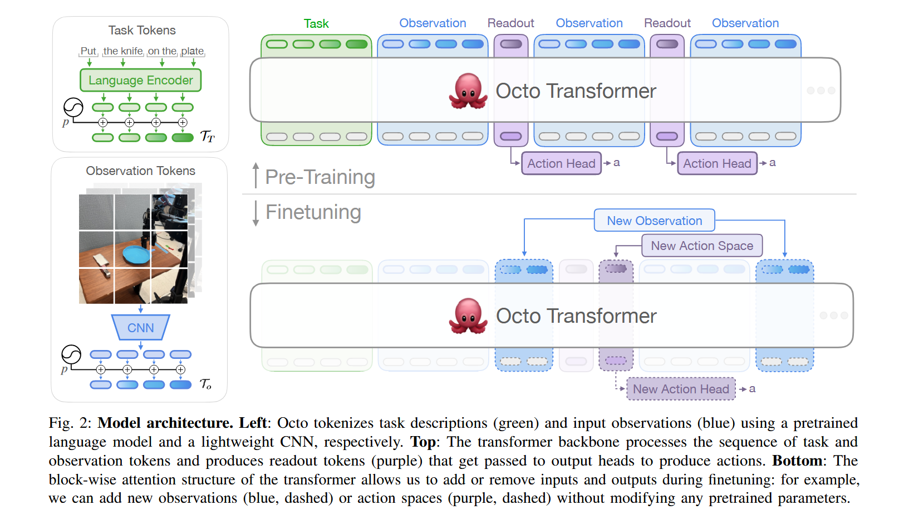
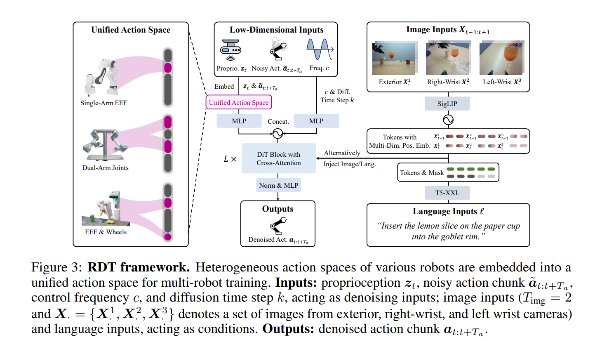

# Paper Reading: Embodied AI 1

> VLA; RL; DP

[TOC]

### Octo: An Open-Source Generalist Robot Policy

https://arxiv.org/pdf/2405.12213

a transformer-based diffusion policy (VLA)

tokenization -> transformer -> diffution head

- 用自己机器人的一小部分数据（比如 50 条演示），对 Octo 进行微调

### RDT-1B: a Diffusion Foundation Model for Bimanual Manipulation

https://github.com/thu-ml/RoboticsDiffusionTransformer

**物理异构性 (Physical Heterogeneity)**

机器人的不同部位在物理属性上差异极大

- **移动底盘**：位移大（米级），频率低。
- **机械臂**：位移中等，动作平滑。
- **灵巧手**：位移极小（毫米级），频率高，维度多。

**视觉遮挡 (Occlusion)**：当机械手接近物体时，摄像头视野被遮挡，视觉 Token 包含的信息量急剧下降。

**接触动力学 (Contact Dynamics)**：视觉无法直接观测摩擦系数、硬度和接触力。

**微调精度**：Diffusion 生成的轨迹在接触瞬间往往不够精细（容易产生过冲或接触不足），触觉可以作为**局部修正信号**。

- 采用了类似 Sora 的 DiT 架构

**数据**：使用了 46 个不同的机器人数据集（基于 Open X-Embodiment 扩展），包含各种不同的机械臂和灵巧手。

### RT-2: Vision-Language-Action Models Transfer Web Knowledge to Robotic Control

https://arxiv.org/abs/2307.15818

语义理解能力强(闭源)

### Isaac Lab: A GPU-Accelerated Simulation Framework for Multi-Modal Robot Learning

### TinyVLA

https://arxiv.org/abs/2409.12514

使用 LoRA 的 Pi-like VLA

### Pi0

https://arxiv.org/abs/2410.24164

### Pi0.5

https://arxiv.org/abs/2504.16054

### Pi0.6

https://arxiv.org/abs/2511.14759

### GEN-0

### ⭐Diffusion Policy

https://arxiv.org/abs/2303.04137

### ⭐DreamVLA

https://arxiv.org/abs/2507.04447

### InternData A1

https://arxiv.org/abs/2511.16651

大规模合成数据

### PaliGemma: A versatile 3B VLM for transfer

https://arxiv.org/pdf/2407.07726

