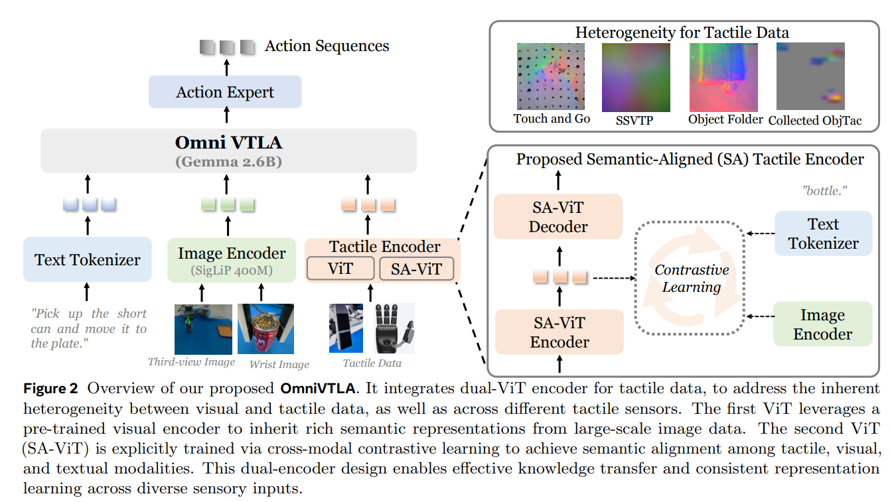

# Paper Reading: Embodied AI 2

> Visuo-Tactile Learning

[TOC]

### ⭐VLA-Touch: Enhancing Vision-Language-Action Models with Dual-Level Tactile Feedback

https://arxiv.org/abs/2507.17294

1）如何在大多数预训练模型没有触觉输入信息的情况下，使智能体能够有效地获取和规划触觉信息;2）当基础模型缺乏专用触觉输入方式时，如何将触觉感知整合进现有的 VLA 流水线？

1）一个利用预训练的触觉语言模型的流水线，为高级任务规划提供语义触觉反馈，（2）一个基于扩散的控制器，通过触觉信号来细化 VLA 生成的动作，以实现接触丰富的操作。通过真实世界实验，我们证明了我们的触觉反馈的双重整合提高了**任务规划**的效率，同时提高了执行的**精确度**。

规划阶段：触觉生成推理物理性质的**文本**，辅助**运动规划**。

控制阶段：触觉感知提供了表面摩擦和接触事件检测等信息，完善**策略学习**，以实现精确的操作。

实验：软硬、光滑、质量

**Interpolant Model**

**损失函数**：主要是流匹配损失（Flow Matching Loss），即最小化预测速度场与真实插值路径速度场之间的差异。

### Learning to Feel the Future: DreamTacVLA for Contact-Rich Manipulation

https://arxiv.org/html/2512.23864v1

###  Universal Visuo-Tactile Video Understanding for Embodied Interaction🔺

https://arxiv.org/pdf/2505.22566

### UniTacHand: Unified Spatio-Tactile Representation for Human to Robotic Hand Skill Transfer

https://arxiv.org/abs/2512.21233

### ✔Low-Fidelity Visuo-Tactile Pre-Training Improves Vision-Only Manipulation Performance

https://arxiv.org/html/2406.15639v4

- **实验设置：** 对比使用昂贵的GelSight传感器（>3000美元）和自制的低成本BeadSight传感器（<50美元，基于水凝胶珠）进行预训练。
- **发现：** 即使使用信号噪声大、精度低的BeadSight进行多模态预训练，并在推理时**丢弃触觉分支（Vision-Only Inference）**，其性能也比纯视觉训练提升了 **65%**。起到了**特征正则化**和**物理归纳偏置**的作用。

### ⭐TVASK: Gentle Manipulation Policy Learning via Demonstrations from VLM Planned Atomic Skills

https://arxiv.org/html/2511.05855v1

策略层面的蒸馏

通过特权信息（仿真中的力传感器）引导视觉策略学习特定的运动学特征（如减速接近、柔顺接触）是完全可行的

### ⭐Tactile-VLA: Unlocking Vision-Language-Action Model's Physical Knowledge for Tactile Generalization🔺

https://arxiv.org/abs/2507.09160  https://jialeihuang.github.io/tactileVLA.github.io/

### ⭐Text2Touch: Tactile In-Hand Manipulation with LLM-Designed Reward Functions🔺

https://arxiv.org/pdf/2509.07445

### ⭐OmniVTLA: Vision-Tactile-Language-Action Model with Semantic-Aligned Tactile Sensing🔺

https://arxiv.org/pdf/2508.08706

OmniVTLA 在 *π*0 的基础上引入了语义对齐的触觉编码器，本身的对齐就是通过**对比损失**，在论文中自己采集的触觉数据集（触觉传感器接触不同的材质，其中图像是 camera 信息，文字是材质名称）上进行训练。在这里事实上从结果来看，因为只有真机实验，和 baseline 的效果对比并不显著，但是事实上触觉的存在还是有必要的。

大量的失败主要在于对于抓取时机的把握不准，也就是可能还没有到达指定的深度，就已经触发了抓取，这里使用深度或者触觉在一定程度上都可以解决这个问题，通过更加显式的信号来进行引导，触觉可能是可以带来更多用处的一个方法，也是值得探索的。

### General In-Hand Object Rotation with Vision and Touch

https://haozhi.io/rotateit/

### Robot Synesthesia: In-Hand Manipulation with Visuotactile Sensing

https://arxiv.org/pdf/2312.01853

### GR-Dexter Technical Report

https://arxiv.org/pdf/2512.24210

### ⭐𝒟⁢(ℛ,𝒪) Grasp: A Unified Representation of Robot and Object Interaction for Cross-Embodiment Dexterous Grasping

https://arxiv.org/html/2410.01702v2

D(R,O) Grasp 提取灵巧手以及物体的点云的 Feature，然后用 CVAE 预测距离矩阵，然后进行优化，因为优化可以并行，所以性能很高也很快。

### World Models Can Leverage Human Videos for Dexterous Manipulation

https://arxiv.org/abs/2512.13644

### Dexterous World Models

https://arxiv.org/abs/2512.17907

### CLAP: Contrastive Latent Action Pretraining for Learning Vision-Language-Action Models from Human Videos

https://arxiv.org/abs/2601.04061v1

### MANO: Embodied Hands--Modeling and Capturing Hands and Bodies Together

https://arxiv.org/abs/2201.02610

### ⭐RDP: Reactive Diffusion Policy: Slow-Fast Visual-Tactile Policy Learning for Contact-Rich Manipulation

https://arxiv.org/abs/2503.02881

### ⭐ImplicitRDP: An End-to-End Visual-Force Diffusion Policy with Structural Slow-Fast Learning

https://implicit-rdp.github.io/    https://arxiv.org/pdf/2512.10946

### **3D-ViTac**: Learning Fine-Grained Manipulation with Visuo-Tactile Sensing 

Binghao Huang

https://arxiv.org/abs/2410.24091

对于需要极高精度的操作（如USB插拔、精密零件装配），隐式Token融合往往丢失了精确的空间信息。

**严重遮挡任务 (Heavy Occlusion)**：例如“手内操作”（In-hand manipulation）或“插孔”（Peg insertion）。当机械手抓住物体时，外部相机通常看不见物体与孔的接触点，此时 3D 触觉点云能像“透视眼”一样补全接触面的几何形状。

**易碎物体操作 (Fragile Interaction)**：例如“蒸蛋”任务（抓取生鸡蛋）或“处理葡萄”。需要通过触觉反馈精确控制力度，防止捏碎物体。

**精细装配 (Fine-Grained Assembly)**：例如收集六角扳手并插入孔中。这需要极高的毫米级精度。

**融合管线**

1. **反投影**：利用深度图（Depth Map）和触觉阵列的已知几何参数，将触觉读数转换为点云 $P_{tactile}$。
2. **坐标统一**：通过手眼标定矩阵 $T_{camera}^{hand}$，将视觉点云 $P_{visual}$ 和触觉点云 $P_{tactile}$ 变换到世界坐标系。

3. **体素化或采样**：为了处理点云密度的不一致，通常采用最远点采样（Farthest Point Sampling, FPS）或体素化网格（Voxel Grid）进行归一化。

**扩散策略（Diffusion Policy）的条件生成**

- 在动作生成阶段，扩散模型被广泛采用。扩散模型通过逐步去噪生成动作序列，不仅能建模多模态分布（例如，抓取同一个杯子可能有多种合法的姿态），还能很好地处理触觉带来的高频扰动。

- **触觉作为强约束**：在扩散模型的逆向生成过程中，触觉特征作为强条件（Conditioning）输入。实验表明，当触觉信号检测到意外碰撞时，扩散模型能够迅速生成“回撤”或“柔顺化”的动作轨迹，这种反应速度和合理性远超传统的行为克隆模型 。

### VT-Refine: Learning Bimanual Assembly with Visuo-Tactile Feedback via Simulation Fine-Tuning

http://arxiv.org/abs/2510.14930

### ⭐CraftNet - a Hierarchical VTLA Model for Fine Manipulation

2026-01-06

https://www.sharpa.com/blogs/news/sharpa-announces-craftnet-a-hierarchical-vtla-model-for-fine-manipulation